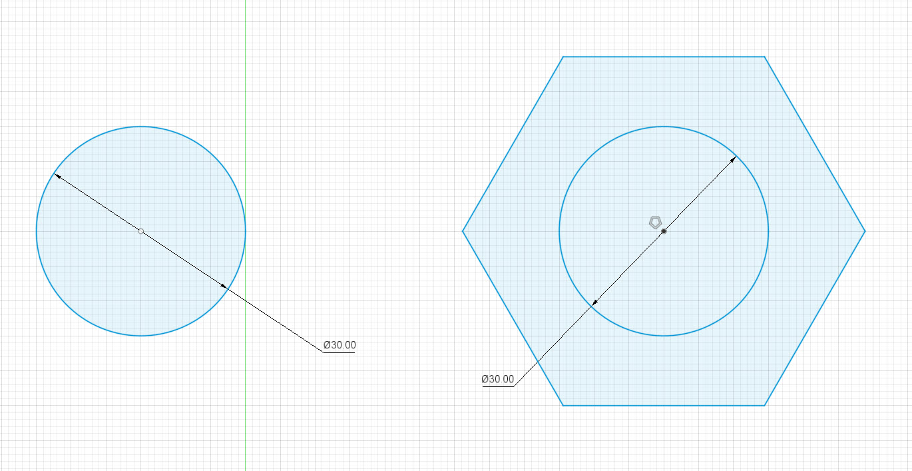
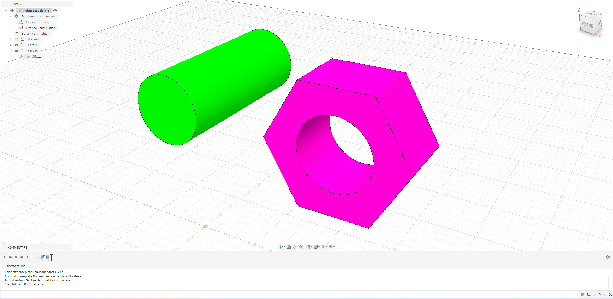
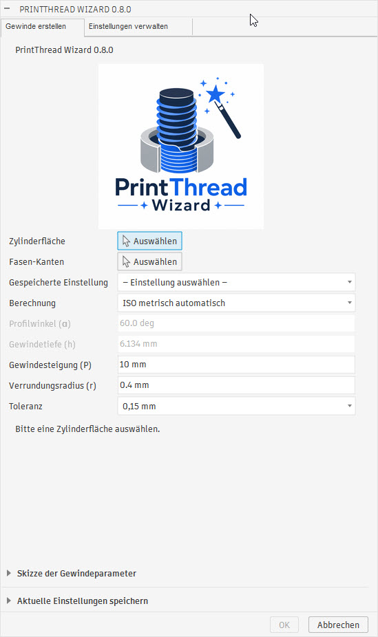
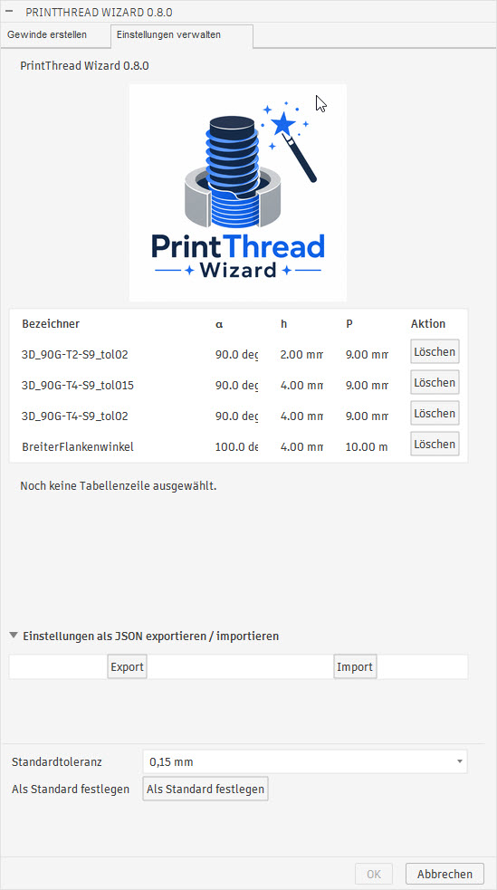
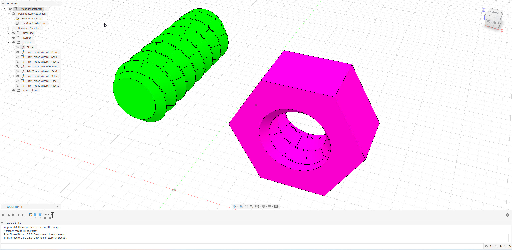
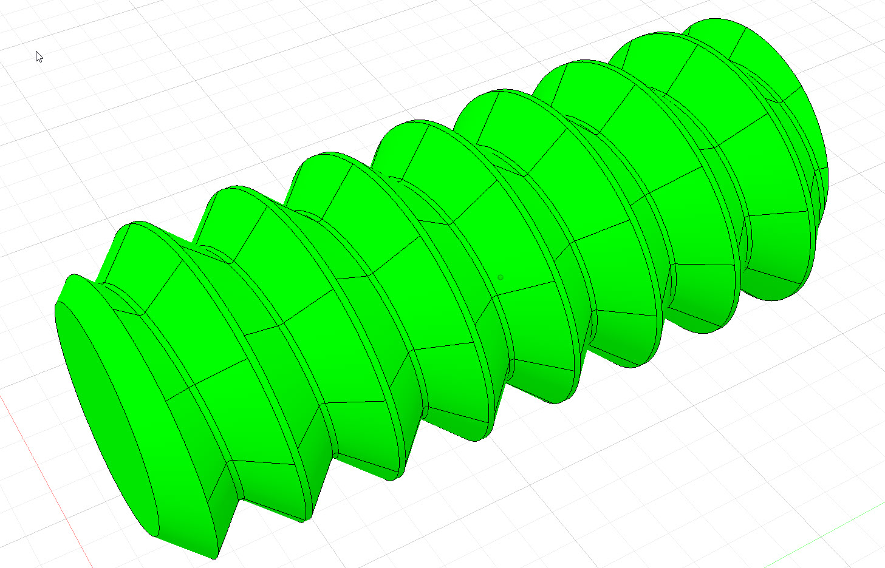
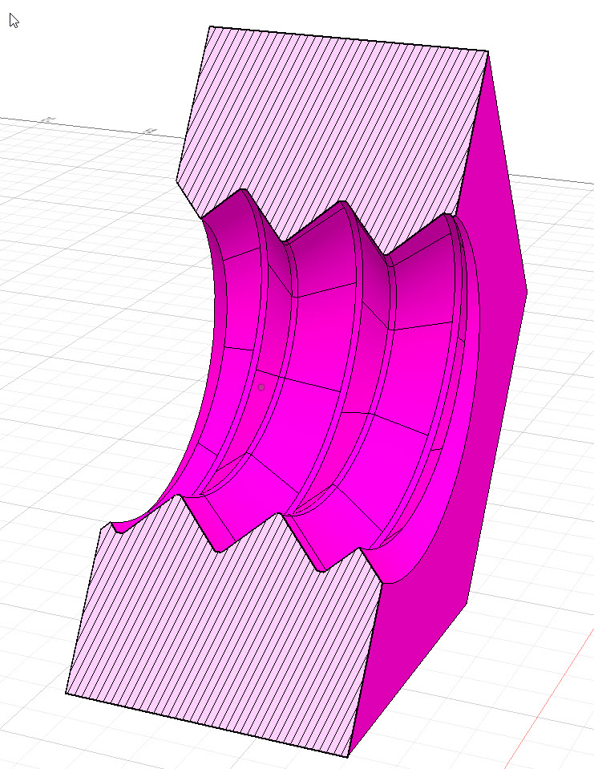

# PrintThread Wizard


[Deutsch](README_DE.md) | English

PrintThread Wizard is an Autodesk Fusion add-in for generating modeled external
and internal threads on selected cylindrical faces. Its geometry is intended
for functional FDM/FFF parts and can be adjusted for the clearance required by
3D-printed mating components.

More Fusion 360 video tutorials are available on the
[Know-How-Schmiede YouTube channel](https://www.youtube.com/c/knowhowschmiede),
or via the [direct channel link](https://www.youtube.com/channel/UCuEKsFW7ojVm20DLiC_2V2g).
I would be very happy if you subscribed to the channel.

Current development version: **0.8.0**

> **Development notice:** This add-in was developed with assistance from OpenAI
> Codex and remains under active development. Features, the user interface, and
> generated geometry may still change.

## Current features

- Automatic use of the Fusion UI language for German, English, Spanish,
  French, Italian, and Polish, with English as the fallback

- Automatic detection of external cylinders and internal bores
- Modeled right-hand thread geometry using an exact B-Rep helix and sweep
- ISO metric calculation mode with a 60° flank angle and automatically
  calculated radial thread depth
- Free geometry mode for manually setting flank angle and thread depth
- Adjustable pitch and root fillet radius
- Selectable total radial clearance from 0.00 to 0.50 mm in 0.05 mm steps;
  persistent default: 0.15 mm
- Optional chamfers on one or two selected circular end edges
- Chamfer angle derived from half the flank angle
- Helix overrun beyond both end faces for complete thread starts and ends
- All generated construction steps collected in a collapsed Fusion timeline
  group named `PrintThread Wizard – Gewinde`
- Hidden documentation sketch as the first group entry containing thread type,
  nominal diameter, `P`, `α`, `h`, `r`, tolerance, `d`, `d2`, `d1`, `T`, and
  the number of chamfer edges
- Local storage of the current thread settings with a name and note
- Alphabetically sorted preset selection that restores all saved thread values
- Separate tabs for thread creation including the save controls and for
  managing saved settings
- Technical symbols and a profile diagram for pitch `P`, major diameter `d`,
  pitch diameter `d2`, minor diameter `d1`, tap-drill diameter `T`, profile
  depth `h`, and included angle `α`
- Compact preset table with name, `α`, `h`, `P`, and a delete action
- Selecting a table row displays its complete values and note
- JSON import and export in a dedicated dialog section with status feedback
- Dedicated brand logo for the Fusion dialog, GitHub, and websites

## How clearance works

The selected tolerance represents the total radial clearance of a mating
thread pair. It is split equally between both parts when the same setting is
used for the external and internal thread:

- The external thread radius is reduced by half the selected tolerance.
- The internal thread radius is increased by half the selected tolerance.
- The thread profile depth remains unchanged.
- Flanks, crests, cylindrical surfaces, and chamfers are generated relative to
  the adjusted radius.

For example, a tolerance of 0.2 mm reduces the external radius by 0.1 mm and
increases the internal radius by 0.1 mm. The best setting depends on printer,
material, layer height, extrusion calibration, and part orientation.

## Images
















## Installation

### Windows installer

1. Download `PrintThreadWizard_Setup_0.8.0.exe` from the GitHub Releases page.
2. Run the installer. It copies the add-in to the current Windows user's
   Fusion add-ins directory; administrator privileges are not required.
3. Restart Fusion or open **Utilities > Add-Ins > Scripts and Add-Ins** and
   start **PrintThread Wizard**.
4. Optionally enable automatic startup.

### Manual installation on Windows

Alternatively, download the repository and copy the complete
`Fusion_AddIn/PrintThread Wizard` directory to
`%APPDATA%\Autodesk\Autodesk Fusion\API\AddIns\PrintThread Wizard`. Restart
Fusion afterwards, or add and start the add-in through **Scripts and Add-Ins**.

### Manual installation on macOS

There is currently no macOS installer. In Finder, copy the complete
`Fusion_AddIn/PrintThread Wizard` directory to
`~/Library/Application Support/Autodesk/Autodesk Fusion/API/AddIns/PrintThread Wizard`.
The user `Library` directory is normally hidden; open Finder's **Go** menu while
holding **Option (⌥)** to access it. Then restart Fusion and start the add-in
through **Scripts and Add-Ins**.

> **macOS notice:** The macOS installation has not been tested because no Mac
> is available for development. Feedback about installation on macOS is
> therefore welcome.

The command is added to the **Design** workspace in the **Solid > Create**
panel.

## Usage

1. Prepare a cylindrical boss for an external thread or a cylindrical bore for
   an internal thread. The selected diameter is treated as the nominal thread
   diameter, for example 50 mm for M50-like geometry.
2. Start **PrintThread Wizard**.
3. Select the cylindrical face.
4. Optionally select one or both circular end edges for chamfering.
5. Optionally select a saved setting, or choose **ISO metric automatic** or
   **Free geometry** manually.
6. Enter the pitch and, in free mode, the flank angle and thread depth.
7. Select the required tolerance and set the root fillet radius.
8. Optionally enter a thread name and short note, then use **Save current
   settings** to store the parameter set.
9. Check the calculated values in the result field and confirm the command.

For a matching pair, use the same nominal diameter, pitch, flank geometry, and
tolerance for both parts.

## Dialog parameters

| Parameter | Description |
| --- | --- |
| Cylindrical face | Target face; internal/external type is detected automatically |
| Chamfer edges | Optional selection of up to two circular end edges |
| Saved setting | Alphabetically sorted preset list; restores all parameters |
| Calculation | ISO metric automatic or free geometry |
| Included angle (α) | Thread included angle; fixed at 60° in ISO mode |
| Thread depth (h) | Radial profile depth; calculated in ISO mode |
| Pitch (P) | Axial distance per revolution |
| Root fillet radius (r) | Rounds the sharp thread root |
| Tolerance | Total radial clearance of the mating thread pair |
| Thread name | Name of the locally stored parameter set |
| Short note | Optional description of up to 500 characters |

Parameter sets are stored per user in the versioned JSON file
`PrintThread Wizard/thread-presets.json` below the operating system's
application-data directory. Model-specific faces and edges are not stored.

The **Manage settings** tab lets the user persist the tolerance selected by
default whenever a new dialog opens. A scrollable table lists all saved
parameter sets with their name, included angle `α`, thread depth `h`, and
pitch `P`. Entries can be deleted by row.

The **Export/import settings as JSON** section saves or loads all presets,
including the default tolerance. Success, cancellation, and errors are shown
directly below the two buttons.

The result field shows the thread type, nominal diameter, `P`, `d`, `d2`, `d1`,
`T`, `α`, tolerance, and calculation mode. The diagram below maps these symbols
to the thread profile.

## Known limitations

- This is development software; validate generated geometry before production.
- Only cylindrical faces and right-hand threads are currently supported.
- Pitch is entered manually; the add-in does not yet provide a standard thread
  size/pitch catalogue.
- Clearance values are starting points and require calibration for the actual
  printer and material.
- The generated geometry is not intended for certified or safety-critical
  threaded connections.

## Repository structure

```text
Fusion_AddIn/PrintThread Wizard/
├── PrintThread Wizard.py
├── PrintThread Wizard.manifest
├── config.py
├── version.py
├── commands/
│   └── commandDialog/
├── core/
│   ├── iso_metric.py
│   └── thread_parameters.py
└── fusion/
    ├── chamfer.py
    ├── face_analysis.py
    └── thread_geometry.py
```

The development history is documented in
[doku/version-timeline.md](doku/version-timeline.md).

## License and disclaimer

See [LICENSE](LICENSE). PrintThread Wizard is intended for prototypes, hobby
projects, fixtures, and other non-safety-critical applications. Always verify
fit, strength, and suitability of printed parts for their intended use.
